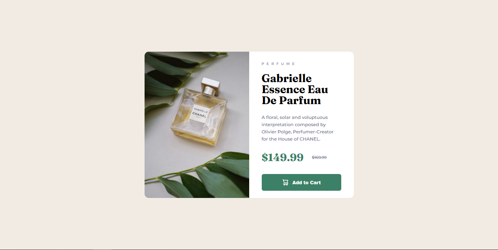

## Pt-Br
------------------------------------------------------------------------------------------------------------------------------------------------ 
# Frontend Mentor - Solução de Componente de Qr Code
Olá! 
Seja muito bem-vindo(a) a minha solução para o desafio do Componente do Cartão de Visualização do Produto feito pelo Frontend Mentor (https://www.frontendmentor.io/challenges/product-preview-card-component-GO7UmttRfa/hub). Este Readme servirá como seu guia para o entendimento deste projeto. Ele terá como base o template disponiblizado pela própria plataforma do Frontend Mentor.

Sem mais delongas, quero agradeço por disponibiliziar um pouco do seu tempo visitando o meu projeto! :D
Todo feedback é bem-vindo!!

------------------------------------------------------------------------------------------------------------------------------------------------

## Índice

- [Visão Geral](#visão-geral)
    -[Captura de Tela](#captura-de-tela)
- [Meu processo](#meu-processo)
    -[Construído com](#construído-com)
    -[O que aprendi](#o-que-aprendi)
    -[Desenvolvimento Contínuo](#desenvolvimento-contínuo)
- [Autor](#autor)
- [Agradecimentos](#agradecimentos)

------------------------------------------------------------------------------------------------------------------------------------------------

## Visão Geral
### Captura de tela


------------------------------------------------------------------------------------------------------------------------------------------------

## Meu Processo 
### Construído com 
- HTML 
- CSS

### O que aprendi 
Neste projeto decidi treinar mais um pouco a questão dos seletores. Também aproveitei para praticar estilização de fontes com o letter-spacing, organização de código e estilização de botão com background-position e text-indent.

No código a seguir treinei a questão do Seletor de filho e a utilização do letter-spacing, que sempre deve ser feita com a medida em EM ou REM.
``` Seletor de Filho + lettring-Spacing
div#infos>span {
    font-family: 'Montserrat', sans-serif;
    font-size: 0.7em;
    letter-spacing: 0.7em;
    font-weight: 500;
    text-transform: uppercase;
    color: hsl(228, 12%, 48%);
}
```
Já nesse código testei uma forma de organizar todas as declarações e aproveitei para tester algumas propriedades do background. 
``` Organização de Seletor + Estilização de background 
input {
    width: 100%;
    height: 40px;
    margin-top: 25px;
    border-radius: 5px;
    border: none;
    font-size: 0.9em;
    font-weight: 800;
    text-align: center;
    text-indent: 25px;
    color: hsl(0, 0%, 100%);
    background-image: url(./images/icon-cart.svg);
    background-repeat: no-repeat;
    background-position: center center;
    background-position-x: 50px;
    background-size: 14px;
    background-color: hsl(158, 36%, 37%);
   color: hsl(220, 15%, 55%);
}
```

### Desenvolvimento Contínuo
Futuramente pretendo voltar nesse projeto para atualizar as responsividade e aplicar a @média que ainda irei estudar. Sinto que finalmente to progredindo na programação. 

------------------------------------------------------------------------------------------------------------------------------------------------

## Autor 
- Frontend Mentor [@StenioVenancius](frontendmentor.io/profile/StenioVenancius)
- Twitter [@veennix](https://twitter.com/veennix)

------------------------------------------------------------------------------------------------------------------------------------------------

## Agradecimentos 
Muito Obrigado por ter lido até aqui ❣️
Sinta-se avontade para enviar seu feedback!

------------------------------------------------------------------------------------------------------------------------------------------------
------------------------------------------------------------------------------------------------------------------------------------------------
## EN
------------------------------------------------------------------------------------------------------------------------------------------------

# Frontend Mentor - QR code component solution
Hello! 
Welcome to my solution to the Product Preview Card Component challenge made by Frontend Mentor (https://www.frontendmentor.io/challenges/product-preview-card-component-GO7UmttRfa/hub). This Readme will serve as your guide to understanding this project. It will be based on the template provided by the Frontend Mentor platform itself.

Without further ado, I want to thank you for making some of your time available visiting my project! :D
All feedback is welcome!!

------------------------------------------------------------------------------------------------------------------------------------------------

## Table of contents
- [Overview](#Overview)
    -[Screenshot](#screenshot)
- [My process](#my-process)
    -[Built with](#built-with)
    -[What I Learned](#What-I-Learned)
    -[Continuous-Development](#Continuous-Development)
- [Author](#author)
- [Acknowledgments](#acknowledgments)

------------------------------------------------------------------------------------------------------------------------------------------------

## Overview
### Print Screen


------------------------------------------------------------------------------------------------------------------------------------------------

## My Process
### Built with
- HTML
- CSS

### What I learned
In this project I decided to train a little more the issue of selectors. I also took the opportunity to practice font styling with letter-spacing, code organization and button styling with background-position and text-indent.

In the following code I trained the issue of the Child Selector and the use of letter-spacing, which should always be done with the measurement in EM or REM.
``` Child Selector + lettring-Spacing
div#infos>span {
    font-family: 'Montserrat', sans-serif;
    font-size: 0.7em;
    letter-spacing: 0.7em;
    font-weight: 500;
    text-transform: uppercase;
    color: hsl(228, 12%, 48%);
}
```
Already in this code I tested a way to organize all the declarations and took the opportunity to test some properties of the background. 
``` Selector Organization + Background Styling 
input {
    width: 100%;
    height: 40px;
    margin-top: 25px;
    border-radius: 5px;
    border: none;
    font-size: 0.9em;
    font-weight: 800;
    text-align: center;
    text-indent: 25px;
    color: hsl(0, 0%, 100%);
    background-image: url(./images/icon-cart.svg);
    background-repeat: no-repeat;
    background-position: center center;
    background-position-x: 50px;
    background-size: 14px;
    background-color: hsl(158, 36%, 37%);
   color: hsl(220, 15%, 55%);
}
```

### Continuous Development
In the future I intend to return to this project to update the responsiveness and apply the @media that I will still study. I feel like I'm finally making progress on programming. 

------------------------------------------------------------------------------------------------------------------------------------------------

## Author
- Frontend Mentor [@StenioVenancius](frontendmentor.io/profile/StenioVenancius)
- Twitter [@veennix](https://twitter.com/veennix)

------------------------------------------------------------------------------------------------------------------------------------------------

## Acknowledgments
Thank you so much for reading this far ❣️
Feel free to submit your feedback!

------------------------------------------------------------------------------------------------------------------------------------------------